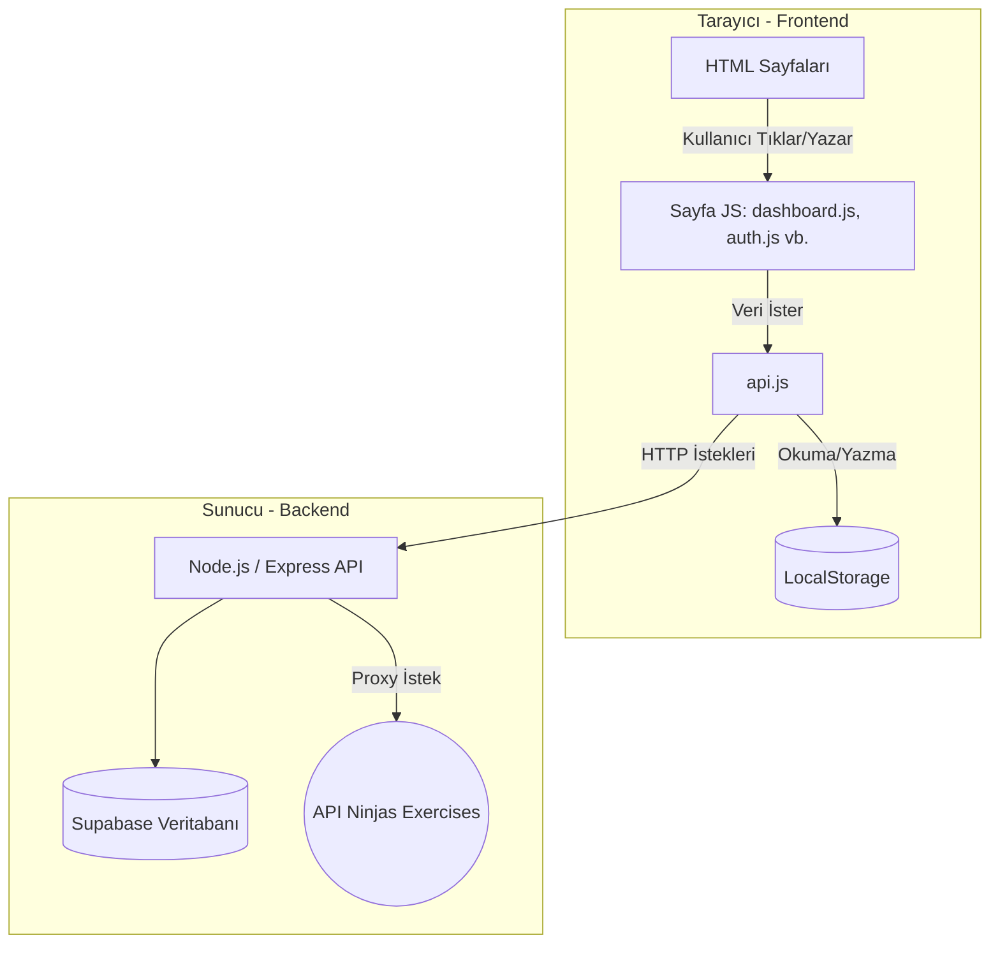

# BÖLÜM 1: Frontend Mimarisi ve Yapısı 🏗️

Projemiz geleneksel bir "Single Page Application (SPA - React/Vue/Angular)" yerine, **Çoklu Sayfa (Multi-Page Application) + Modüler JavaScript** yaklaşımıyla inşa edilmiştir. Yani her HTML sayfasının kendine ait bir görevi ve ona bağlı bir JS (Mantık) dosyası vardır.

### Görsel Mimari Haritası (Ne Nereye Gidiyor?)



### Proje Ağacının Görevleri:
1.  **`pages/` Klasörü (Görünümler - Views):** Kullanıcının gördüğü iskelettir. Sadece HTML kodlarını barındırır.
2.  **`assets/css/` (Stiller):** CSS'ler parçalara ayrılmıştır (Örn: Sadece giriş sayfasını ilgilendiren kodlar `auth.css` içindedir). Bu, kodun çorbaya dönmesini engeller.
3.  **`assets/js/` (Beyin ve Sinir Sistemi):** Tüm asıl olayın döndüğü yerdir.

### En Önemli Dosya: `api.js` (Köprü)
Frontend ile Backend arasındaki **sınır kapısıdır**. Diğer hiçbir JS sayfası (*dashboard, exercises vb.*) direkt olarak backend'e istek atmaz. Hepsi `api.js` içindeki nesneleri çağırır. Bu mimari desene **"Service Layer (Servis Katmanı)"** veya **"Gateway"** denir. Kodun tek bir yerden yönetilmesini sağlar.

---

# BÖLÜM 2: Bilinmesi Gereken Zor Kavramlar 🧠

Sunumda hocaların veya izleyicilerin sorabileceği teknik kavramlar şunlardır:

1.  **Asenkron Programlama (Async / Await):**
    JavaScript normalde kodları yukarıdan aşağıya beklemeden okur ve geçer. Ancak backend'den veri çekmek (sunucuya git gel) zaman alır. Eğer beklemeden geçersek ekrana boş veri basılır. `async/await` kullanarak JS'e *"Git veriyi al, gelene kadar bu satırda bekle, sonra devam et"* diyoruz. Sayfanın donmasını engeller (Non-blocking).
2.  **Token (JWT) ve Kimlik Doğrulama:**
    Kullanıcı giriş yaptığında backend bize anlamsız uzun bir metin (Token) verir. Bu bizim "Dijital Kimlik Kartımız"dır. Frontend bu kartı tarayıcının kasasına (`localStorage`) koyar. Sonra backend'den gizli bir veri isterken (örn: Profilim) bu kartı `Authorization: Bearer <token>` başlığıyla (header) gösteririz.
3.  **DOM Manipülasyonu (jQuery):**
    HTML statiktir (ölüdür). Gelen verilere göre ekrana dinamik bir şeyler çizmek (yeni bir ders kartı eklemek, üye adını ekrana basmak) işlemine DOM Manipülasyonu denir. Projede bu işlemi kolaylaştırmak için `$` ile başlayan yapıları yani **jQuery** kütüphanesini kullandık.

---

# BÖLÜM 3: JavaScript Nesne ve Fonksiyon Rehberi 📚

Aşağıda, projede kullandığımız ana Javascript özelliklerinin önce **"Genel Programlama Mantığı"**, ardından **"Bizim Kodumuzdaki Karşılığı"** verilmiştir. Sunumda bunları açıklarken çok havalı duracaktır.

### 1. Object (Nesneler) Kullanımı
**Genel Mantık:** Birbiriyle ilişkili verileri ve fonksiyonları tek bir küme içinde toplamamızı sağlar. Değişken kirliliğini önler.
**Bizim Kodumuzda:** `api.js` içine bakarsan tüm backend işlemlerini API'lere göre nesnelere (Object) böldük.

```javascript
/* GENEL ANLATIM */
const Araba = {
   marka: "Toyota",
   calistir: () => console.log("Araba çalıştı")
};

/* BİZİM PROJEDE (api.js) */
const AuthAPI = {
  login: (email, password) => apiFetch('/auth/login', { method: 'POST', body: JSON.stringify({ email, password }) }),
  register: (first, last, email, password) => apiFetch('/auth/register', { method: 'POST', body: JSON.stringify({ first_name, last_name, email, password }) }),
  me: () => apiFetch('/auth/me')
};
// Kullanımı: AuthAPI.login("admin@byem.com", "123456");
```
*Sunumda ne demelisin?* -> "API fonksiyonlarını global değişkenler yapmak yerine kapsülleme (Encapsulation) yaparak `AuthAPI`, `ClassesAPI` gibi nesneler oluşturduk. Bu sayede kodumuz çok daha organize oldu."

### 2. fetch() ve Custom (Özel) apiFetch Fonksiyonu
**Genel Mantık:** `fetch()`, tarayıcının internetten kendi başına veri indirmesini sağlayan gömülü bir fonksiyondur.
**Bizim Kodumuzda:** Sürekli aynı header'ları (ve token'ı) yazmamak için kendi `apiFetch` sarmallayıcı (wrapper) fonksiyonumuzu yazdık.

```javascript
/* BİZİM PROJEDE (api.js) */
async function apiFetch(endpoint, options = {}) {
  const token = Auth.getToken(); // LocalStorage'dan anahtarı al
  
  // İstek başlıklarını ayarla, token varsa ekle
  const headers = {
    'Content-Type': 'application/json',
    ...(token ? { 'Authorization': `Bearer ${token}` } : {}),
    ...options.headers
  };

  // Sunucuya istek at, cevabı bekle (await)
  const response = await fetch(`${API_BASE}${endpoint}`, { ...options, headers });
  const data = await response.json(); // Gelen metni JSON objesine çevir

  if (!response.ok) throw new Error(data.error); // Hata varsa yakala
  return data;
}
```
*Sunumda ne demelisin?* -> "Kod tekrarını (DRY - Don't Repeat Yourself presibi) önlemek için merkezi bir `apiFetch` servisi yazdık. Bütün authentication (token okuma) ve hata yakalama (error handling) işi tek bir fonksiyondan yönetiliyor."

### 3. LocalStorage (Tarayıcı Hafızası)
**Genel Mantık:** Sayfayı yenilediğinizde silinmeyen, 5MB boyutunda tarayıcı içi cep belleğidir.
**Bizim Kodumuzda:** Giriş yapan kullanıcının kim olduğunu uygulama unutmasın diye JWT token'ı burada sakladık. Bunu yönetmek için de `Auth` objesini yazdık.

```javascript
/* BİZİM PROJEDE (api.js) */
const Auth = {
  // Hafızaya yaz (Giriş yapınca çalışır)
  setToken: (token) => localStorage.setItem('byem_token', token),
  
  // Hafızadan oku (İstek atarken çalışır)
  getToken: () => localStorage.getItem('byem_token'),
  
  // Hafızayı temizle ve Login sayfasına git (Çıkış Yapınca)
  logout: () => {
    localStorage.removeItem('byem_token');
    window.location.href = '../pages/login.html';
  }
};
```

### 4. URLSearchParams (Arama Parametreleri Üretici)
**Genel Mantık:** API'ye veri yollarken URL'in sonuna eklenen `?isim=burak&kas=gogus` gibi karmaşık yapıları temiz bir şekilde oluşturmayı sağlar.
**Bizim Kodumuzda:** `exercises.js` (Egzersiz filtreleme) sayfasındaki karmaşık filtreleme mantığında kullanıldı.

```javascript
/* BİZİM PROJEDE (exercises.js) */
async function fetchExercises (params, reset) {
  // objeyi query string'e çeviriyor
  // Örn params = { muscle: "chest", difficulty: "beginner" }
  // limit=12&offset=0&muscle=chest&difficulty=beginner
  const query = new URLSearchParams({ limit: 12, offset: 0, ...params }).toString();

  const response = await apiFetch(`/exercises?${query}`);
}
```

---

# BÖLÜM 4: jQuery İle DOM Manipülasyonu

jQuery'nin resmi mottosu **"Write less, do more" (Daha az yaz, daha çok iş yap)** şeklindedir. Saf (Vanilla) JavaScript ile 5 satırda yapacağınız bir HTML değiştirme veya tıklama olayını, jQuery ile tek satırda yaparsınız. Bunu sağlayan sihirli şey **`$` (Dolar) işaretidir.** `$` işareti jQuery'nin kısaltmasıdır.

### 1. Element Seçmek (Selectors)
**Genel Mantık:** Ekranda (HTML'de) var olan bir yazıyı, butonu veya kutuyu JavaScript tarafına çekmek. Tıpkı CSS yazar gibi `#` (id) veya `.` (class) kullanırız.

**Saf JavaScript (Vanilla JS):**
```javascript
const aramaKutusu = document.getElementById("searchInput");
const icindekiDeger = aramaKutusu.value;
```

**Bizim Projede (jQuery):**
```javascript
/* exercises.js içinden */
const name = $('#searchInput').val(); 
```
*Sunumda ne demelisin?* -> "getElementById gibi uzun komutlar yerine `$()` seçicisiyle HTML içindeki ID ve Class'lara CSS seçicileri gibi doğrudan ulaştık. Bu kodumuzun okunabilirliğini çok artırdı."

### 2. Olay Dinleyiciler (Event Listeners - Tıklama, Yazma)
**Genel Mantık:** Kullanıcının mouse ile tıklaması, klavyeden tuşa basması gibi olayları "dinleyip" bir fonksiyon çalıştırmak. `.on('olay', fonksiyon)` şeklinde kullanılır.

**Saf JavaScript:**
```javascript
document.getElementById("loadMoreBtn").addEventListener("click", function() {
   // Yüklenecek kodlar
});
```

**Bizim Projede (jQuery):**
```javascript
/* exercises.js içinden - Daha Fazla Yükle Butonu */
$('#loadMoreBtn').on('click', async function () {
   offset = offset + LIMIT;
   fetchExercises(currentParams, false);
});

/* Klavyeden Enter'a basınca arama yapma */
$('#searchInput').on('keydown', function (e) {
  if (e.key === 'Enter') {
     doSearch();
  }
});
```
*Sunumda ne demelisin?* -> "Kullanıcı etkileşimlerini (interactivity) yönetmek için jQuery'nin `.on()` metodunu kullandık. Böylece 'click', 'keydown' gibi olayları çok temiz bir şekilde yakaladık."

### 3. DOM Manipülasyonu (Ekrana Dinamik Veri Yazma/Silme)
**Genel Mantık:** Backend'den veri geldi diyelim. Bu veriyi HTML içine yerleştirmemiz (Render) gerekir. jQuery'de en çok kullandığımız 4 komut vardır:
1. `.text()` -> Elementin sadece yazısını değiştirir.
2. `.html()` -> Elementin içindeki her şeyi silip, yolladığınız HTML'i yazar.
3. `.empty()` -> Elementin içini komple temizler.
4. `.append()` -> Elementin içindeki mevcut şeyleri silmez, **sonuna** yenisini ekler.

**Bizim Projede (dashboard.js ve exercises.js):**
```javascript
/* dashboard.js - Veritabanından gelen Kullanıcı adını ekrana basmak */
$('#userName').text(user.full_name); 

/* exercises.js - Egzersizler yüklenirken ekrana iskelet (skeleton) yüklenme animasyonu koymak */
$('#exercisesGrid').html('<div class="skeleton-card"></div>');

/* exercises.js - Yeni arama yaparken önce eski sonuçları temizlemek */
if (reset) {
   $('#exercisesGrid').empty(); 
}

/* dashboard.js - Rezervasyonları alt alta döngüyle listelemek (.append hayat kurtarır) */
bookings.forEach(b => {
   $('#bookingList').append(`
      <div class="booking-item">
         <span class="booking-name">${b.classes.name}</span>
      </div>
   `);
});
```
*Sunumda ne demelisin?* -> "Veritabanından aldığımız JSON verilerini `.append()` ve `.html()` kullanarak arayüze (DOM) entegre ettik. Sayfayı hiç yenilemeden asenkron olarak verileri ekrana dizmemizi bunlar sağladı."

### 4. CSS Class Yönetimi ve Görünürlük Çözümleri
**Genel Mantık:** Bazen bir div'i gizlemek, bazen rengini kırmızı yapmak isteriz. Elemanlara dinamik olarak `.addClass()` (class ekle) veya `.removeClass()` (class sil) uygularız. HTML tarafında `<div class="hidden">` olduğunu düşünün (display: none yapar).

**Bizim Projede:**
```javascript
/* exercises.js - Pagination (Sayfalama) Mantığı */

// Eğer gelen egzersiz sayısı bizim LIMIT (10 diyelim) sayımıza eşitse
// Demek ki daha fazla egzersiz var, "Daha Fazla Yükle" butonunu göster
if (response.length === LIMIT) {
   $('#loadMoreWrap').removeClass('hidden'); // hidden class'ını sil (buton görünür olur)
} else {
   // Gelen veri 10'dan azsa, demek ki son sayfadayız, butonu gizle
   $('#loadMoreWrap').addClass('hidden'); // hidden class'ını ekle (buton gizlenir)
}

/* dashboard.js - Üyelik bitmesine 7 günden az kaldıysa Yeşil rengi Kırmızıya çevir */
if (daysLeft < 7) {
   $('#membershipStatus').removeClass('badge-success').addClass('badge-danger').text('Sona Eriyor');
}
```
*Dikkat Çekici Nokta:* Son `dashboard.js` örneğinde `.removeClass().addClass().text()` işlemlerini uç uca ekledik. jQuery'nin bu özelliğine **"Method Chaining (Zincirleme)"** denir. Kodu inanılmaz ölçüde kısaltır.

---

### Özetle Hazırlık (Bir Soru Gelirse Ne Diyeceksin?)

**Soru:** *Neden koca projeyi React, Vue veya Angular gibi Framework'ler yerine saf HTML + API + jQuery ile yaptınız?*

**Cevap:** *"Projemizin amacı Client-Server (İstemci-Sunucu) mimarisinin en alt (core) yapı taşlarını, fetch API kullanımını ve doğrudan DOM manipülasyonunu kavramaktı. React gibi yapıların "Virtual DOM" (Sanal DOM) gibi soyutlamaları aslında arka planda bu temel Javascript yeteneklerini kullanıyor. Temelleri jQuery ve Service Layer (api.js) mimarisiyle öğrenerek çok sağlam bir altyapı oluşturduğumuzu düşünüyoruz."*